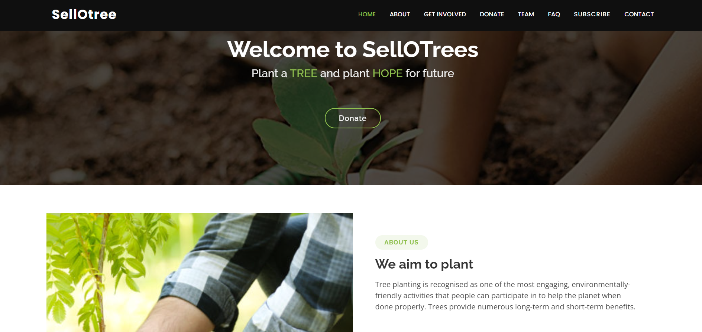
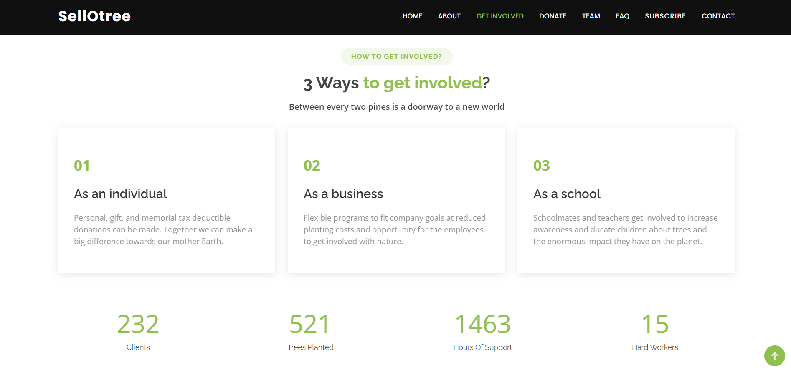
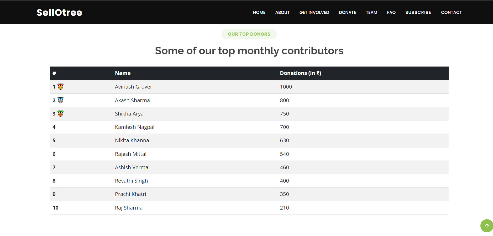
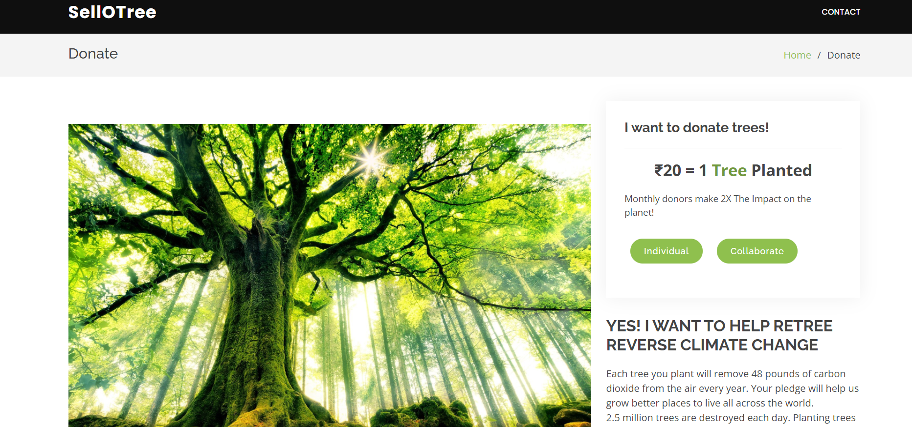
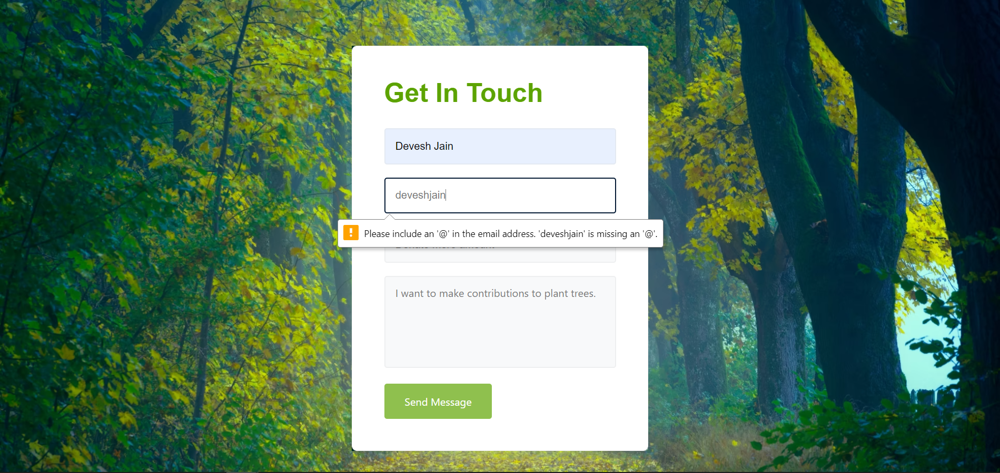
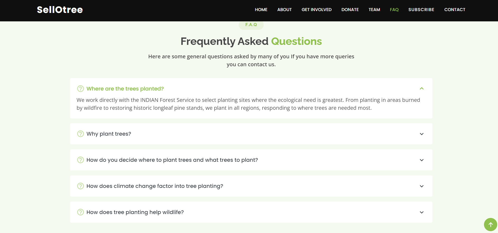
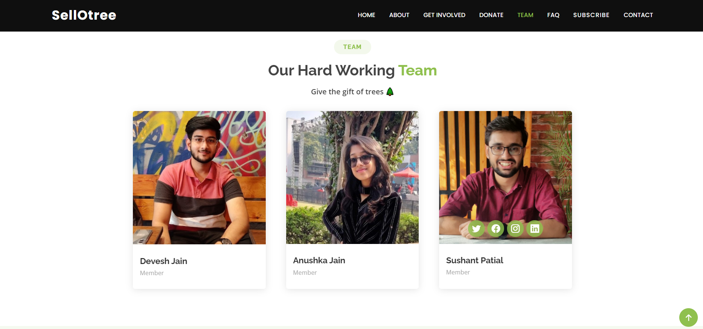

#  SellOTree

SellOTree is a web app for fundraising. This website aims towards raising funds for tree plantation and generates hope for the future. Every 20 Rupees contributed counts as a tree planted. Users can donate and make their contributions as well as they can also participate in the ongoing drives where we would link them to the various plantation drives. They can be involved individually or as a business group that may include flexible programs to fit company goals at reduced planting costs or even the children and teachers can get involved to increase awareness and educate children about the enormous impact that trees have on our planet. 

### Inspiration
Due to massive commercialization, we are somewhere neglecting our mother Earth. Environment's CO2 level is increasing at an alarming rate. So, to deal with it we can perform our roles as a concerned citizen and take initiative towards making contributions for a better future.

### Home

### Get Involved

### Top Contributors

### Donate

### Contact Us

### Newsletter

### FAQs

### Team

## Features
* Payment Gateway (Donate) 
* Get Involved
* Live Contributor's count
* Top Donor's list 
* Contact Us 
* Newsletter Subscription 

* FAQs 

## What's next for SellOTree
Establishing SellOTree's plantation drives and starting with the collaboration for generating nurseries. Selling biodegradable products in future is also in scope.

## 👇 Download Files
* Go to our GitHub repository: https://github.com/anushkajain6459/SellOTrees
* Download Zip or clone repo
* Then open the folder in your IDE 
* Run index.html file

## Website
* Link: https://anushkajain6459.github.io/SellOTrees/

